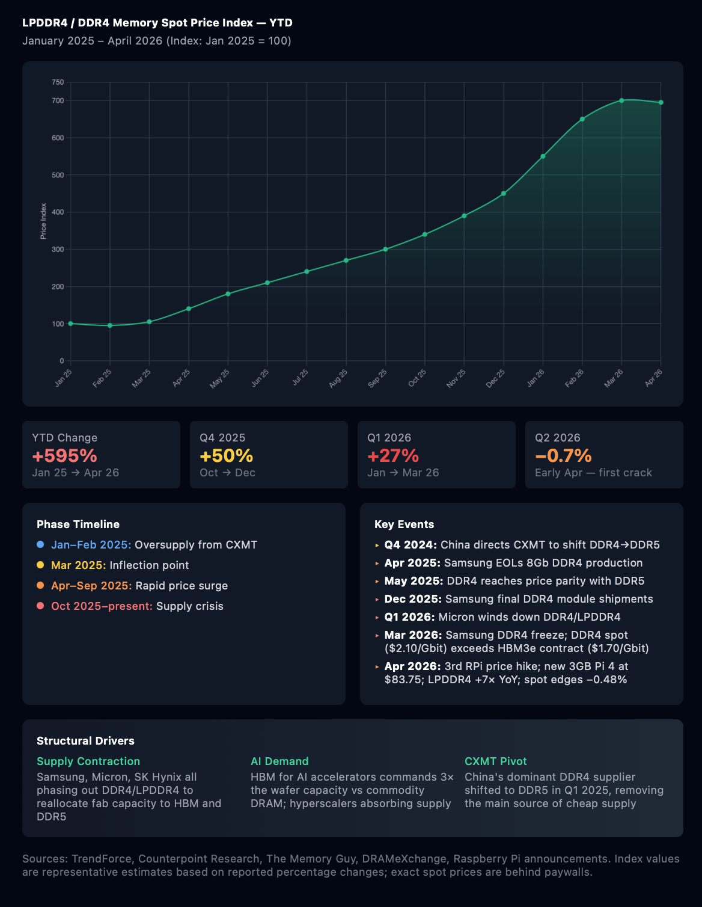

# LPDDR4 / DDR4 Memory Spot Price Index — YTD

An interactive chart tracking the dramatic rise in LPDDR4 and DDR4 memory prices from January 2025 through April 2026.

## The Story

Memory prices have increased **+595% YTD** driven by a perfect storm of factors:

- **AI demand** — HBM for AI accelerators now commands 3× the wafer capacity vs commodity DRAM
- **Supply contraction** — Samsung, Micron, and SK Hynix are phasing out DDR4/LPDDR4 to focus on HBM and DDR5
- **CXMT pivot** — China's dominant DDR4 supplier shifted to DDR5 production in Q1 2025, removing the main source of cheap supply

The impact is visible in products like the Raspberry Pi 5, which has now seen three price hikes in six months — the 16GB model went from $120 to $205 in February 2026, then climbed another $100 in April. Raspberry Pi also introduced a new 3GB Pi 4 at $83.75, using two 1.5GB LPDDR4 chips because they're cheaper to source.

As of April 2026, DDR4 spot prices ($2.10/Gbit) have overtaken HBM3e contract prices ($1.70/Gbit) — a structural inversion where legacy memory costs more than cutting-edge AI memory. Spot momentum has begun to cool (−0.48% in mid-April), but absolute levels remain near crisis peaks, and Counterpoint projects shortages will persist until at least Q4 2027.

## Key Dates

| Date | Event |
|------|-------|
| Q4 2024 | China directs CXMT to shift DDR4→DDR5 |
| Mar 2025 | Inflection point — prices begin rising |
| Apr 2025 | Samsung EOLs 8Gb DDR4 production |
| May 2025 | DDR4 reaches price parity with DDR5 |
| Dec 2025 | Samsung final DDR4 module shipments |
| Q1 2026 | Micron winds down DDR4/LPDDR4 |
| Mar 2026 | Samsung DDR4 freeze; DDR4 spot overtakes HBM3e contract |
| Apr 2026 | 3rd RPi price hike; new 3GB Pi 4 at $83.75; LPDDR4 +7× YoY |

## View the Chart

**Option 1:** [View live version](https://kevinagomez.github.io/Raspberry-Pi/)

**Option 2:** Download `lpddr4_price_chart.html` and open it in any browser

## Data Sources

- [TrendForce](https://www.trendforce.com/price/dram/dram_spot) — DRAM spot and contract pricing
- [Counterpoint Research](https://counterpointresearch.com/) — Memory market analysis
- [The Memory Guy](https://thememoryguy.com/) — DDR4/DDR5 price trend analysis
- [Raspberry Pi Announcements](https://www.raspberrypi.com/news/) — Product pricing updates

**Note:** Index values are representative estimates based on reported percentage changes. Exact spot prices are behind industry paywalls.

## Tech Stack

- Plain HTML/CSS/JavaScript (no build tools required)
- [Chart.js](https://www.chartjs.org/) for visualization

## License

MIT — use freely, attribution appreciated.
